# Super Resolution for Real Time Image Enhancement


    
<div align="center">
    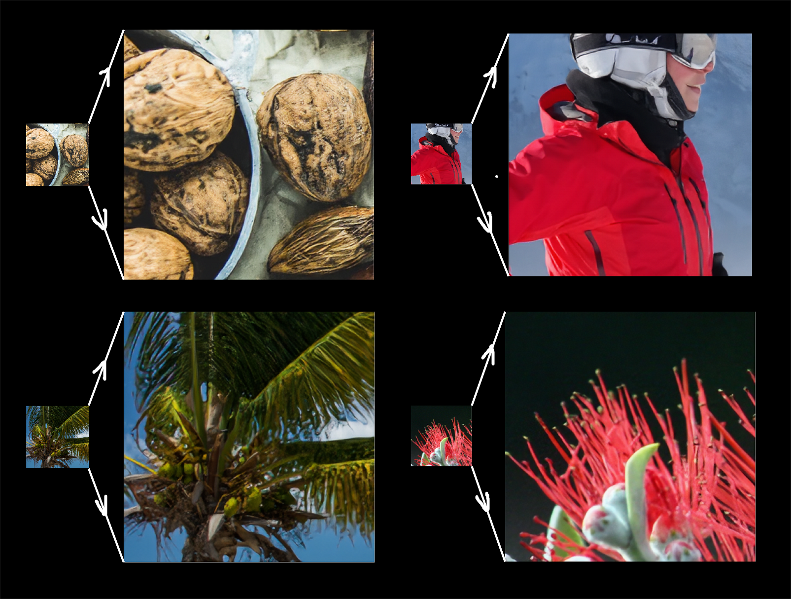
</div>

# Final Results from Validation data

<table align="center">
    <tr>
    <td>
    
    </td>
    <td>
    
    </td>
    </tr>
</table>

# Introduction

It is no suprising that adversarial training is indeed possible for super resolution tasks. The problem with pretty much all the state of the art models is that they are just not usable for native deployment, because of 100s of MBs of model size.

Also, most of the known super resolution frameworks only works on single compression method, such as bicubic, nearest, bilinear etc. Which helps the model a lot to beat the previous state of the art scores but they perform poorly on real life low resolution images because they might not belong to the same compression method for which the model was trained for.

So for me the main goal with this project wasn't just to create yet another super resolution model, but to develop a lightest model as possible which works well on any random compression methods.


With this goal in mind, I tried adopting the modern super resolution frameworks such as relativistic adversarial training, and content loss optimization (I've mainly followed the [ESRGAN](https://arxiv.org/abs/1809.00219), with few changes in the objective function), and finally was able to create a **model of size 5MB!!!**

# API Usage

```python
from inference import enhance_image

enhance_image(
    lr_image, # <low res image from tf.io>, # or lr_path = <path to lr image>,
    sr_path, # <output sr path>,
    visualize, # <whether to visualize the outputs or not>
    size, # <plot size>,
    )
```

# CLI Usage

```
usage: inference.py [-h] [--lr-path LR_PATH] [--sr-path SR_PATH]

Super Resolution for Real Time Image Enhancement

optional arguments:
  -h, --help         show this help message and exit
  --lr-path LR_PATH  Path to the low resolution image.
  --sr-path SR_PATH  Output path where the enhanced image would be saved.
```

# Model architectures

The main building block of the generator is the Residual in Residual Dense Block (RRDB), which consists of classic DenseNet module but coupled with a residual connection

<div align="center">
    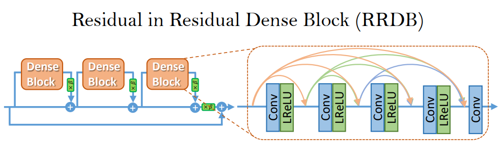
</div>

Now in the original paper the authors mentioned to remove the batch normalization layer in order to remove the checkboard artifacts, but due to the extreme small size of my model, I found utilizing the batch normalization layer quite effective for both speeding up the training and better quality results.

Another change I made in the original architecture is replacing the nearest upsampling proceedure with the pixel shuffle, which helped a lot to produce highly detailed outputs given the size of the model.

The discriminator is made up of blocks of classifc convolution layer followed by batch normalization followed by leaky relu non linearity.

# Relativistic Discriminator

A relativistic discriminator tries to predict the probability that a real
image is relatively more realistic than a fake one.

<div align="center">
    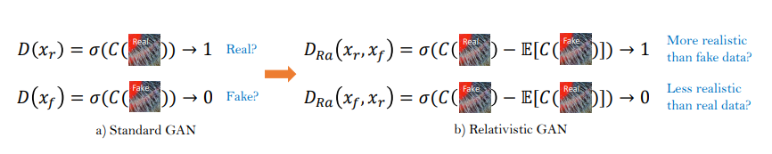
</div>

So the discriminator and the generator are optimized to minizize these corresponding losses:

Discriminator's adversarial loss:
<div align="center">
    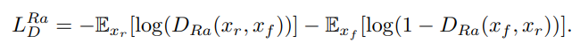
</div>

Generator's adversarial loss:
<div align="center">
    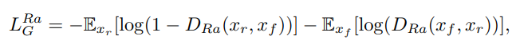
</div>

# Perceptual Loss (Final objective for the Generator)

Original perceptual loss introduced in SRGAN paper combines the adversarial loss and the content loss obtained from the features of final convolution layers of the VGG Net.

Effectiveness of perceptual loss if found increased by constraining on features before activation rather than after activation as practiced in SRGAN.

To make the Perceptual loss more effective, I additionally added the preactivation features disparity from both shallow and deep layers, making the generator produce better results.

In addition to content loss and relativistic adversarial optimization, a simple pixel loss is also added to the generator's final objective as per the paper.

Now based on my experiments I found it really hard for the generator to produce highly detailed outputs when its also minimizing the pixel loss (I'm imputing this observation to the fact that my model is very small).

This is a bit surprising because optimizing an additional objective function which has same optima should help speeding up the training. My interpretation is since super resolution is not a one to one matching, as multiple results are there for a single low resolution patch (more on patch size below), so forcing the generator to converge to a single output would cause the generator to not produce detailed but instead the average of all those possible outputs.

So I tried reducing the pixel loss weight coefficient down to 1e-2 to 1e-4 as described in the paper, and then compared the results with the generator trained without any pixel loss, and found that pixel loss has no significant visual improvements. So given my constrained training environment (Google Colab), I decided not to utilize the pixel loss as one of the part of generator's loss.

So here's the generator's final loss:
<div align="center">
    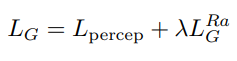
</div>

# Patch size affect

Ideally larger the patch size better the adversarial training hence better the results, since an enlarged receptive field helps both the models to capture more semantic information. Therefore the paper uses 96x96 to 192x192 as the patch size resolution, but since I was constrained to utilize Google Colab, my patch size was only 32x32 😶, and that too with batch size of 8.

# Multiple compression methods

The idea is to make the generator independent of the compression that is applied to the training dataset, so that its much more robust in real life samples.

For this I randomly applied the nearest, bilinear and bicubic compressions on all the data points in the dataset every time a batch is processed.

# Validation Results after ~500 epochs

|<h2>Loss type</h2>|Value|
|--|--|
|Content Loss (L1) [5th, 10th, 20th preactivation features from VGGNet]| ~38.582
|Style Loss (L1) [320th preactivation features from EfficientNetB4]| ~1.1752
|Adversarial Loss| ~1.550

# Visual Comparisons

Below are some of the common outputs that most of the super resolution papers compare with (not used in the training data).

<div align="center">
    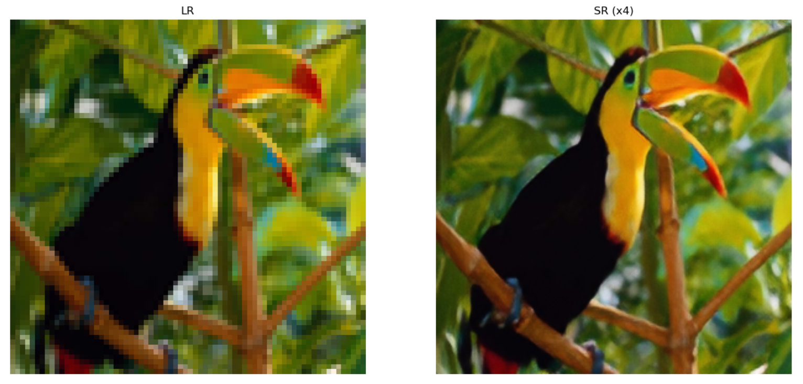
</div>
<div align="center">
    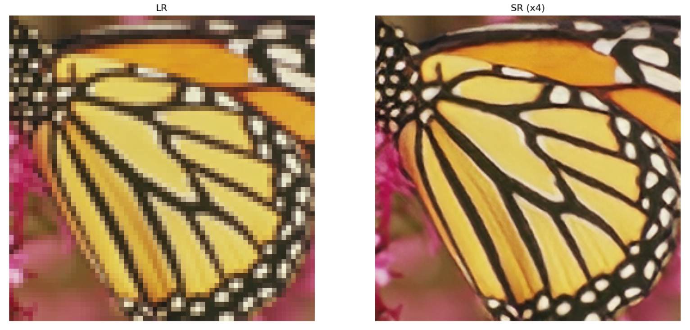
</div>
<div align="center">
    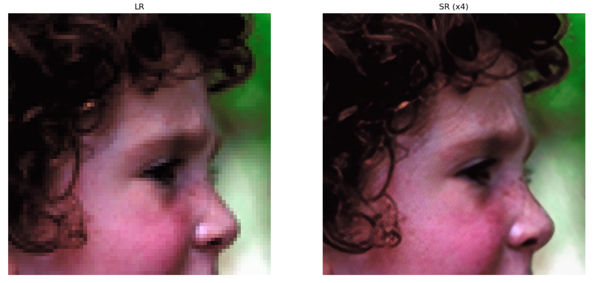
</div>
<div align="center">
    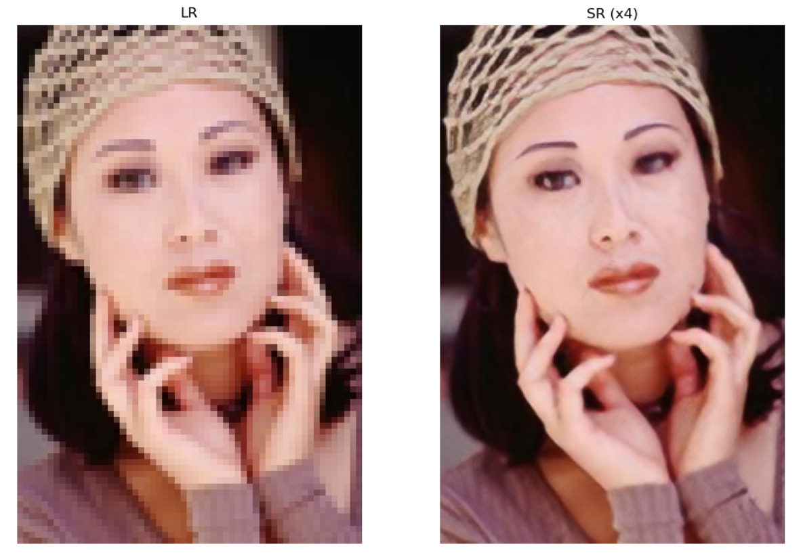
</div>
<div align="center">
    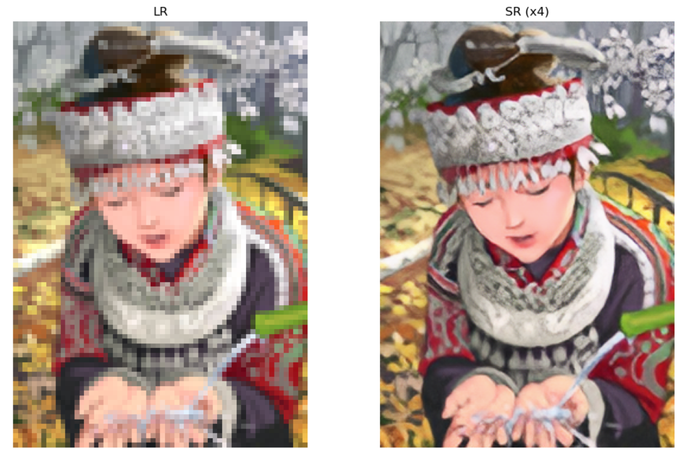
</div>
<div align="center">
    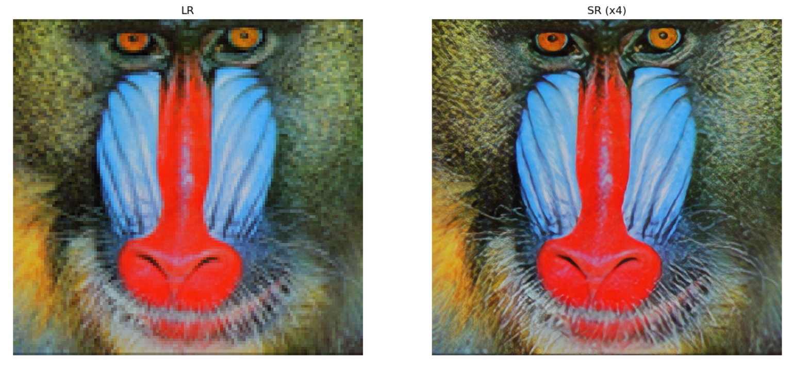
</div>

# Author - Rishik Mourya
